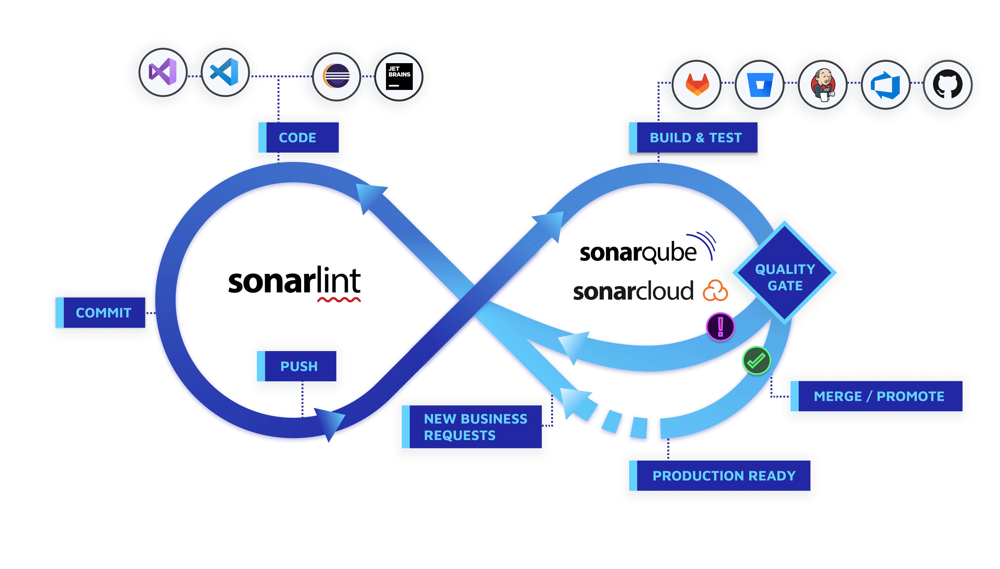

# Welcome

## Code example

```python
def fn():
    pass
```

Please see the [project license](license.md) for further details.

Please see the [project license](../about/license.md) for further details.

Please see the [project license](about.md#license) for further details.





## Tableau example

First Header | Second Header | Third Header
------------ | ------------- | ------------
Content Cell | Content Cell  | Content Cell
Content Cell | Content Cell  | Content Cell


| First Header | Second Header | Third Header |
| ------------ | ------------- | ------------ |
| Content Cell | Content Cell  | Content Cell |
| Content Cell | Content Cell  | Content Cell |


First Header | Second Header | Third Header
:----------- |:-------------:| -----------:
Left         | Center        | Right
Left         | Center        | Right

